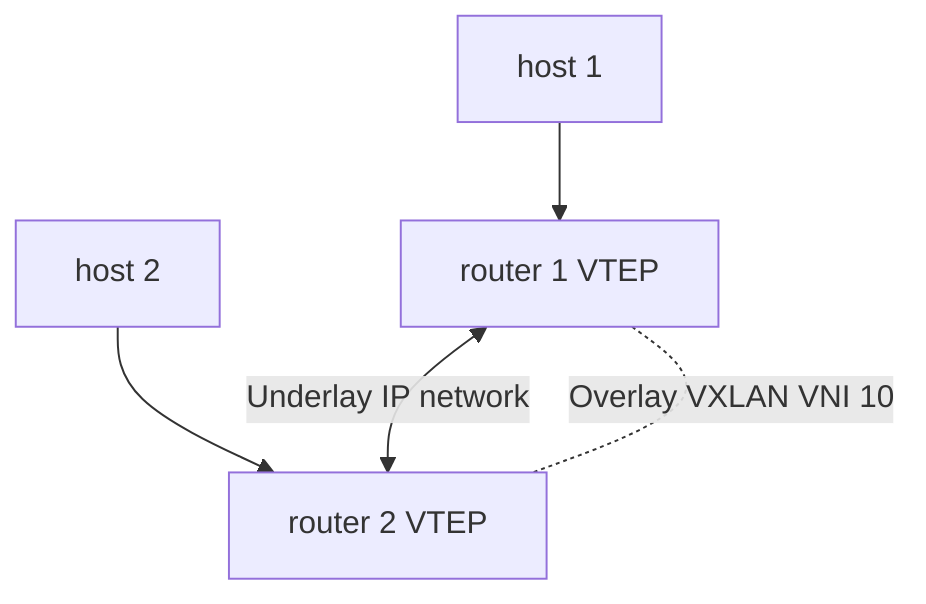

# GNS3 for BADASS Part 2

## Goal of Part 2

Part 2 is where you build your first VXLAN.

The goal is not advanced routing yet.

The real purpose is to make sure you can:

- understand what VXLAN solves
- build a Layer 2 overlay over a Layer 3 underlay
- configure a VXLAN with VNI `10`
- use a Linux bridge named `br0`
- make 2 remote hosts behave as if they are on the same Ethernet LAN
- verify the result with ping, packet capture, and MAC table inspection
- understand the difference between static VXLAN and multicast VXLAN

The subject asks you to do this in 2 modes:

- static mode
- dynamic multicast mode

## What Part 2 Is Really Teaching

In Part 1, you prepared reusable devices.

In Part 2, you use those devices to understand a very important data-center idea:

- hosts can stay in the same Layer 2 segment
- even when they are separated by an IP network

VXLAN is the mechanism that makes this possible.

## What VXLAN Is

VXLAN means Virtual eXtensible LAN.

It allows you to transport Ethernet frames through an IP network.

Simple mental model:

```text
Ethernet frame from host
-> encapsulated inside VXLAN
-> carried inside UDP
-> carried inside IP
-> sent across the routed network
-> decapsulated on the other side
-> delivered as an Ethernet frame again
```

So VXLAN creates a virtual Layer 2 network on top of a normal Layer 3 network.

## The Big Idea: Overlay and Underlay

This is one of the most important concepts in the whole project.

### Underlay

The underlay is the real IP network used to transport packets between the 2 routers.

In this part, that is the network between the routers through the switch.

### Overlay

The overlay is the virtual Ethernet network created by VXLAN.

That is the network where the 2 hosts appear to be in the same LAN.

Simple mental model:

```text
Underlay = the real IP path
Overlay  = the virtual Ethernet segment built on top of it
```

## Main Concepts You Must Understand

## 1. Layer 2

Layer 2 means Ethernet.

It works with:

- MAC addresses
- ARP
- broadcasts
- switches and bridges

The hosts in Part 2 communicate through Layer 2 behavior.

## 2. Layer 3

Layer 3 means IP.

It works with:

- IP addresses
- routing
- routers

The routers use Layer 3 only to transport the VXLAN packets between them.

## 3. VTEP

VTEP means VXLAN Tunnel Endpoint.

This is the device that:

- receives local Ethernet frames
- encapsulates them into VXLAN packets
- sends them over the underlay IP network
- receives VXLAN packets from the remote side
- decapsulates them back into Ethernet frames

In your topology, each router is a VTEP.

## 4. VNI

VNI means VXLAN Network Identifier.

It identifies one VXLAN segment.

For this subject, you must use:

- VNI `10`

This is the VXLAN segment identifier for your overlay network.

## 5. Bridge

The subject asks you to create a bridge named `br0`.

A Linux bridge acts like a small software switch.

You will connect to `br0`:

- the local host-facing interface
- the VXLAN interface

That is what allows local traffic and remote VXLAN traffic to belong to the same Layer 2 domain.

## 6. MAC Address Table

The bridge learns where MAC addresses are located.

It stores that information in a forwarding database, often called FDB or MAC table.

At the end of this part, you should be able to show:

- the local host MAC learned on the local interface
- the remote host MAC learned through the VXLAN interface

## 7. Static VXLAN

In static mode, each router is manually configured with the remote VTEP IP.

So:

- router 1 knows router 2 directly
- router 2 knows router 1 directly

This is the simplest way to understand VXLAN.

## 8. Multicast VXLAN

In multicast mode, VXLAN uses a multicast group for broadcast, unknown unicast, and multicast traffic.

The subject gives an example group:

- `239.1.1.1`

You can change that group if you want.

This mode is more dynamic than fully static forwarding.

## The Required Topology

The subject shows a topology equivalent to this:

```text
          switch_<login>
           /        \
      e0  /          \ e0
         /            \
router_<login>-1    router_<login>-2
      | e1               | e1
      |                  |
host_<login>-1        host_<login>-2
```

Recommended interface meaning:

- `e0` on each router = underlay side
- `e1` on each router = local host-facing side

## How Traffic Moves

Suppose `host_1` wants to ping `host_2`.

This is the logic:

1. `host_1` sends an ARP request because it needs the MAC address of `host_2`.
2. Router 1 receives that Ethernet frame on its local interface.
3. Router 1 sends that frame through the VXLAN tunnel.
4. Router 2 receives the VXLAN packet and decapsulates it.
5. Router 2 injects the original Ethernet frame into its local bridge.
6. `host_2` sees the ARP request and replies.
7. Both sides learn MAC addresses.
8. ICMP ping can now work.

This is why the hosts can be in the same IP subnet even though they are separated by routers.

## Recommended Addressing Plan

The subject says you can configure Ethernet interfaces as you wish.

A clean plan is:

### Underlay network

- `router1 e0 = 30.1.1.1/24`
- `router2 e0 = 30.1.1.2/24`

This network exists only so the routers can reach each other as VTEPs.

### Overlay host network

- `host1 = 10.1.1.1/24`
- `host2 = 10.1.1.2/24`

Important:

- the 2 hosts are in the same subnet
- the routers do not need to route between those 2 host IPs
- this part is mainly a Layer 2 extension exercise

## Architecture View



## Subject-Oriented Workflow

Here is the normal sequence for Part 2:

```mermaid
flowchart LR
    A[Reuse P1 images] --> B[Create P2 GNS3 project]
    B --> C[Place 2 routers 2 hosts and 1 switch]
    C --> D[Configure underlay IP connectivity]
    D --> E[Configure host IPs]
    E --> F[Create br0 on each router]
    F --> G[Create vxlan10 with VNI 10]
    G --> H[Attach local interface and vxlan10 to br0]
    H --> I[Test static VXLAN]
    I --> J[Capture traffic and inspect MAC table]
    J --> K[Switch to multicast mode]
    K --> L[Test again]
    L --> M[Save project]
    M --> N[Export portable ZIP]
```



## Step-by-Step Realization

## Step 1. Reuse your Part 1 images

You already built:

- one host image
- one router image

For Part 2, reuse them.

Your router image must support:

- Linux bridge operations
- the `ip` command
- VXLAN interfaces

If any package is missing, update the router image before going further.

## Step 2. Build the topology in GNS3

Create a new Part 2 project and place:

- 2 router nodes
- 2 host nodes
- 1 Ethernet switch

Connect them exactly as required by the topology.

Use names with your login.

## Step 3. Configure the underlay IP network

On both routers, configure the interface connected to the switch.

Example:

- router 1 underlay IP on `e0`
- router 2 underlay IP on `e0`

At this stage, both routers must be able to ping each other.

If this fails, VXLAN cannot work.

## Step 4. Configure the host IP addresses

Give each host an IP in the same subnet.

Example:

- `host1 = 10.1.1.1/24`
- `host2 = 10.1.1.2/24`

For this part, a default gateway is not the important point. The goal is that both hosts behave as if they are in one Ethernet segment.

## Step 5. Create `br0` on each router

On each router, create a bridge named:

- `br0`

This bridge will represent the local Layer 2 domain.

## Step 6. Add the local host-facing interface to `br0`

Take the interface connected to the local host and attach it to `br0`.

This lets the bridge see the local host traffic.

## Step 7. Create the VXLAN interface

On each router, create a VXLAN interface named:

- `vxlan10`

Use:

- VNI `10`

That is required by the subject.

## Step 8. Static mode

In static mode, configure the VXLAN interface so that each router knows the remote VTEP IP.

Then attach `vxlan10` to `br0`.

At this point, `br0` should connect:

- the local host-facing interface
- the VXLAN interface

Simple mental model:

```text
local host port <-> br0 <-> vxlan10 <-> remote VTEP
```

## Step 9. Bring everything up

Check that these interfaces are up on each router:

- underlay interface
- local host-facing interface
- `vxlan10`
- `br0`

Also ensure the host interfaces are up.

If one critical interface is down, the overlay will fail.

## Step 10. Test static VXLAN

Try a ping from `host1` to `host2`.

Expected result:

- ARP should work through VXLAN
- MAC learning should happen
- ping should succeed

## Step 11. Capture traffic on the underlay

Use GNS3 packet capture on the link between the routers.

You should see VXLAN traffic carried over UDP/IP.

This is an important proof that the encapsulation is really happening.

## Step 12. Inspect the MAC address table

Inspect the bridge forwarding database on both routers.

You want to see:

- local host MAC on the local interface
- remote host MAC on `vxlan10`

This proves that your bridge is learning both local and remote endpoints.

## Step 13. Reconfigure to multicast mode

Once static mode works, test the multicast version.

Configure the VXLAN interface with a multicast group such as:

- `239.1.1.1`

The subject specifically shows that your VXLAN interface should now have a group configured.

## Step 14. Test multicast mode again

Repeat the same checks:

- ping between hosts
- packet capture on the underlay
- bridge MAC table inspection
- VXLAN interface inspection

Now you should be able to explain the functional difference between static mode and multicast mode.

## What the Evaluator Is Likely to Test First

In practice, Part 2 is usually validated with direct checks such as:

- your Part 2 topology exists and boots
- the equipment names are consistent and include your login
- routers can reach each other on the underlay
- both hosts are configured correctly
- `br0` exists on both routers
- the VXLAN interface exists with VNI `10`
- static mode works
- multicast mode works
- packet capture shows VXLAN traffic
- the MAC table shows learned entries

## What You Should Be Able to Explain During Defense

You should learn these terms very well:

- VXLAN
- VTEP
- VNI
- overlay
- underlay
- bridge
- MAC table
- FDB
- encapsulation
- decapsulation
- multicast group
- static VXLAN
- BUM traffic

You should also be ready to answer these questions:

### What problem does VXLAN solve?

It extends a Layer 2 network over a Layer 3 IP network.

### What is a VTEP?

It is the VXLAN tunnel endpoint that encapsulates and decapsulates frames.

### Why do the hosts stay in the same subnet?

Because VXLAN is extending the same Ethernet broadcast domain across the routers.

### What is the purpose of `br0`?

It joins the local Ethernet side and the VXLAN side into one Layer 2 domain.

### What is the role of VNI `10`?

It identifies the VXLAN segment required by the subject.

### Why inspect the MAC table?

To prove that the bridge learned local and remote MAC addresses correctly.

### What changes in multicast mode?

Broadcast, unknown unicast, and multicast traffic can be distributed through a multicast group instead of only a direct static remote configuration.

## Common Mistakes

These are the classic failures in Part 2:

- underlay IP connectivity is broken
- the host-facing interface is not attached to `br0`
- `vxlan10` is created but not attached to `br0`
- wrong VNI used instead of `10`
- interfaces are left down
- the hosts are put in different subnets
- trying to solve the exercise with routing instead of Layer 2 extension
- forgetting to verify the MAC table
- forgetting the multicast mode demonstration
- forgetting the portable ZIP export

## Minimal Validation Checklist

Use this checklist before moving to Part 3:

- the `P2` folder exists at repository root
- the Part 2 topology is saved correctly
- router and host names are consistent and include your login
- the 2 routers can ping each other on the underlay
- the 2 hosts are configured in the same subnet
- `br0` exists on both routers
- `vxlan10` exists on both routers
- VNI `10` is used
- static VXLAN works
- multicast VXLAN works
- packet capture shows VXLAN encapsulation
- MAC table inspection shows expected learning
- configuration files are stored with comments
- portable ZIP export including base images exists

## What You Need To Deliver

Inside `P2/`, you should keep:

- your GNS3 project files
- your configuration files with comments
- the exported portable ZIP including base images
- this explanation file or equivalent documentation

## Submission Reminder

The subject expects:

- one folder for each part at the root of the repository: `P1`, `P2`, `P3`
- configuration files with comments
- a ZIP export of the GNS3 portable project including base images

## Final Summary

If you remember only one thing, remember this:

Part 2 is about extending one Ethernet LAN over an IP network using VXLAN.

The routers act as VTEPs.
The hosts stay in the same Layer 2 segment.
The bridge `br0` joins the local interface and the VXLAN tunnel.
You must first make it work in static mode, then in multicast mode, and prove it with traffic capture and MAC learning.
