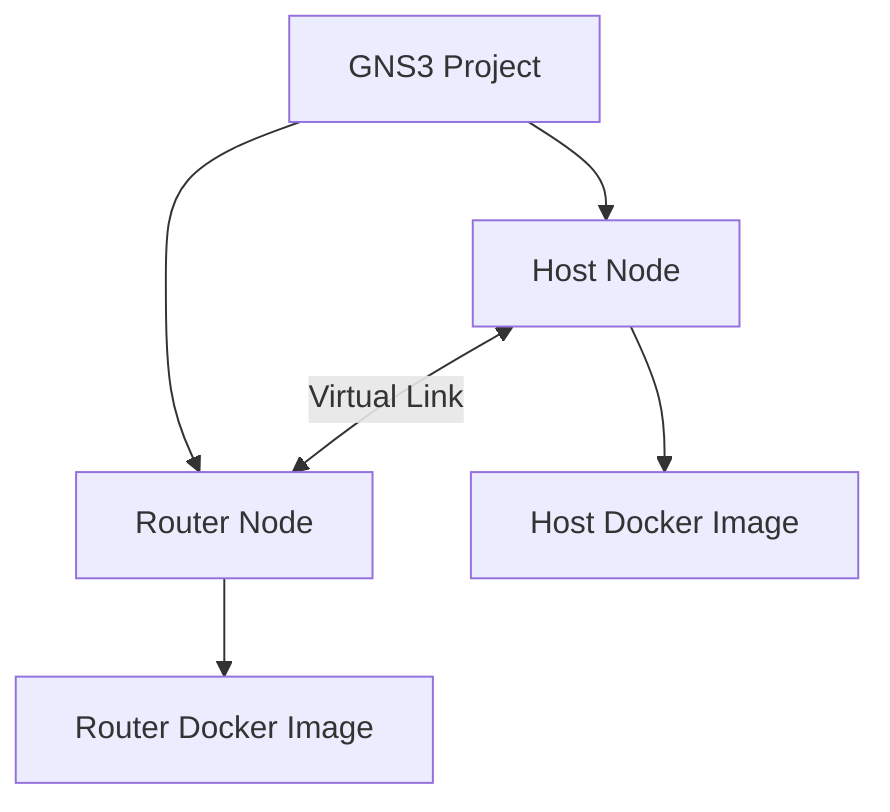
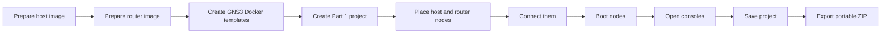

# GNS3 for BADASS Part 1

## Goal of Part 1

Part 1 is not about building a complex routed network yet.

Its real purpose is to make sure you can:

- install and run GNS3 in your VM
- import and use your own Docker-based devices inside GNS3
- connect those devices with virtual links
- open a console on each node
- prepare reusable images for Part 2 and Part 3

The subject asks for 2 images:

- a simple host image with `busybox` or equivalent
- a router image with routing services ready for later work

Important constraint:

- no interface IP address should be configured by default in the base images

## What GNS3 Is

GNS3 is a network lab platform.

It gives you a place where you can:

- place devices on a canvas
- connect them with virtual cables
- start and stop them
- open a terminal on them
- capture traffic on links

For this project, GNS3 is the lab environment. Your Docker containers are the devices.

## Simple Mental Model

```text
Docker image        = the device itself
GNS3 template       = the reusable definition of that device in GNS3
GNS3 node           = one instance placed in a project
GNS3 link           = one virtual Ethernet cable
GNS3 project        = the whole lab topology and its metadata
```

## Main Objects You Must Understand

## 1. Project

A project is the whole lab.

It contains:

- nodes
- links
- placement on the canvas
- project metadata
- optional captures and configs

For the subject, Part 1 must be rendered in a folder at repo root, eventually named `P1` for the final submission.

## 2. Template

A template is a reusable device definition.

Example:

- one template for your host image
- one template for your router image

The template defines things like:

- Docker image name
- number of interfaces
- console type
- startup behavior

You create the template once, then reuse it many times.

## 3. Node

A node is one actual device in a project.

Examples:

- `host_mf7-1`
- `router_mf7-1`

The subject insists that the equipment names include your login.

## 4. Link

A link is a virtual Ethernet cable between two interfaces.

If you connect host `eth0` to router `eth0`, both sides can exchange Ethernet frames.

Later, VXLAN and EVPN will rely on that exact interface-level behavior, so it is important to understand this now.

## 5. Console

The console is the terminal you open from GNS3 to interact with the node.

For Part 1, this is mandatory: the evaluator must be able to connect to both machines from GNS3.

If a node starts but the console is unusable, your setup is not complete.

## Architecture View



## The Part 1 Topology

The required topology is intentionally small.

```text
+---------------------------+
|         GNS3 Lab          |
|                           |
|  host_<login>-1 ---- router_<login>-1  |
|                           |
+---------------------------+
```

What this topology verifies:

- both images can be used as GNS3 nodes
- both nodes boot correctly
- both nodes have working interfaces
- both consoles are accessible
- GNS3 can manage and save the topology

## How GNS3 Uses Docker Nodes

Since you already know Docker, the important point is the GNS3 side:

- GNS3 starts a container from your image
- GNS3 attaches virtual network interfaces to it
- GNS3 exposes a console to access it
- GNS3 connects those interfaces to other nodes with links

So in this project, GNS3 is not replacing Docker. It is orchestrating Docker-based network devices.

## Why the Base Images Must Stay Generic

The same images will be reused in Part 2 and Part 3.

That is why the subject says no default IP address should be configured.

Good approach:

- packages and services are installed
- the node boots cleanly
- interfaces exist
- the configuration is reusable
- actual lab IP addressing is added later per topology

Bad approach:

- the image always configures `eth0` with a fixed IP on startup
- the image assumes one exact topology
- the image cannot be reused for the next parts

## What the Two Images Represent

## Host Image

This one is a simple endpoint.

It is mainly used to:

- open a shell
- inspect interfaces
- test basic connectivity
- generate traffic later with `ping`

Minimal expectation:

- `busybox` or equivalent tools
- a shell accessible from GNS3
- stable execution as a node

## Router Image

This one is the important reusable network device for the rest of the project.

The subject requires:

- packet routing software
- `bgpd` active and configured
- `ospfd` active and configured
- an IS-IS routing engine service
- `busybox` or equivalent

For Part 1, this does not mean you already need a full EVPN fabric. It means the image must already be prepared as a router platform for future parts.

## Required Services

You should be able to explain what these are at a high level:

- `zebra`: routing manager that installs routes in the kernel and coordinates routing daemons
- `bgpd`: BGP daemon
- `ospfd`: OSPF daemon
- `isisd`: IS-IS daemon

Even in Part 1, the important thing is that the routing stack is present and starts properly inside the router node.

## Why Console Access Matters So Much

From the subject, the evaluator must be able to connect to both nodes through GNS3.

That means your image must:

- stay running after startup
- expose a usable shell or CLI
- not exit immediately
- not depend on manual Docker commands outside GNS3

If the image works with `docker run` but not from the GNS3 console, it is not sufficient.

## Interface Mapping

Every adapter shown by GNS3 maps to a network interface inside the container.

Typical mental model:

```text
GNS3 port e0  -> container interface eth0
GNS3 port e1  -> container interface eth1
GNS3 port e2  -> container interface eth2
```

You must always know:

- how many interfaces your template exposes
- which interface is connected to which node
- which interface you will configure later

This becomes very important in VXLAN and EVPN topologies.

## Packet Capture

One of the most useful GNS3 features is packet capture on a link.

Later it will help you verify:

- ARP
- ICMP
- OSPF hellos
- VXLAN encapsulation
- BGP traffic

For Part 1, you just need to know that GNS3 can capture traffic directly on a chosen link.

## Subject-Oriented Workflow

Here is the normal sequence for Part 1:



## What the Evaluator Is Likely to Test First

In practice, Part 1 is usually validated with very direct checks:

- GNS3 starts correctly in the VM
- your custom templates exist
- the 2 nodes can be placed in a project
- both nodes boot
- the host console opens
- the router console opens
- the router services are present/running
- the topology is saved and exportable

## Common Mistakes

These are the classic failures in Part 1:

- container exits immediately after startup
- no usable console from GNS3
- router packages installed but daemons not really running
- interface names or adapter count not matching expectations
- hardcoded IP addresses in the base image
- bad naming that does not include the login
- forgetting the portable ZIP export
- storing only notes in the repo but not the actual project files

## What You Should Be Able to Explain During Defense

For Part 1, learn these terms well:

- GNS3
- template
- node
- link
- console
- portable project export
- routing daemon
- `bgpd`
- `ospfd`
- `isisd`
- why no IP should be configured by default

## Minimal Validation Checklist

Use this checklist before moving to Part 2:

- GNS3 runs correctly in the VM
- host image works as a GNS3 node
- router image works as a GNS3 node
- both nodes are reachable through the GNS3 console
- interfaces are visible inside each node
- router daemons are installed and start correctly
- no interface has a baked-in default IP
- naming includes your login
- project is saved in the correct part folder
- portable ZIP export exists

## Submission Reminder

The subject expects:

- one folder for each part at the root of the repository: `P1`, `P2`, `P3`
- configuration files with comments
- a ZIP export of the GNS3 portable project including base images

Current repo note:

- the repository currently contains `p1/` in lowercase
- before final submission, check whether you want to rename it to `P1/` to match the subject exactly

## Final Summary

If you remember only one thing, remember this:

Part 1 is about building a clean reusable GNS3 lab foundation.

GNS3 provides the virtual topology.
Your Docker images provide the host and router devices.
The router image must already be suitable for the later VXLAN and BGP EVPN parts.
